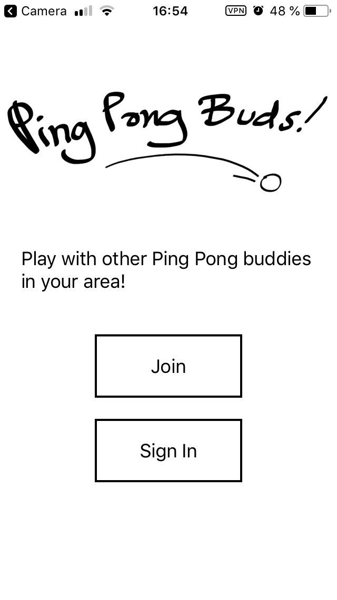

# Currently working on and open topics 
A list of open topics, I would appreciate any tips! :)

## Working on 
### Mobile Application
I am building a React Native/Firebase mobile sports application. 
The aim is to have it approved on the App Store. 
Feel free to get in touch if you'd like to contribute in development!

## Open Topics 
### Hosting / SSL
I am hosting my portfolio (angeliki.herokuapp.com - built with vue & node) on heroku. 
For some reason this is not secure (only http and not https), so google chrome will now allow access.
I have purchased a google domain name (angeliki.dev) and to make it secure I tried adding an SSL key 
but in order to add the SSL key to heroku I have to pay 6$/month. 

It looks to me like there is a better/free way to do this! Any ideas?

### Microservices Architecture
I'm interested to separating a small monolithic application (React, Node) into microservices. 
I know how it should work in theory but not sure how to actually do it!
